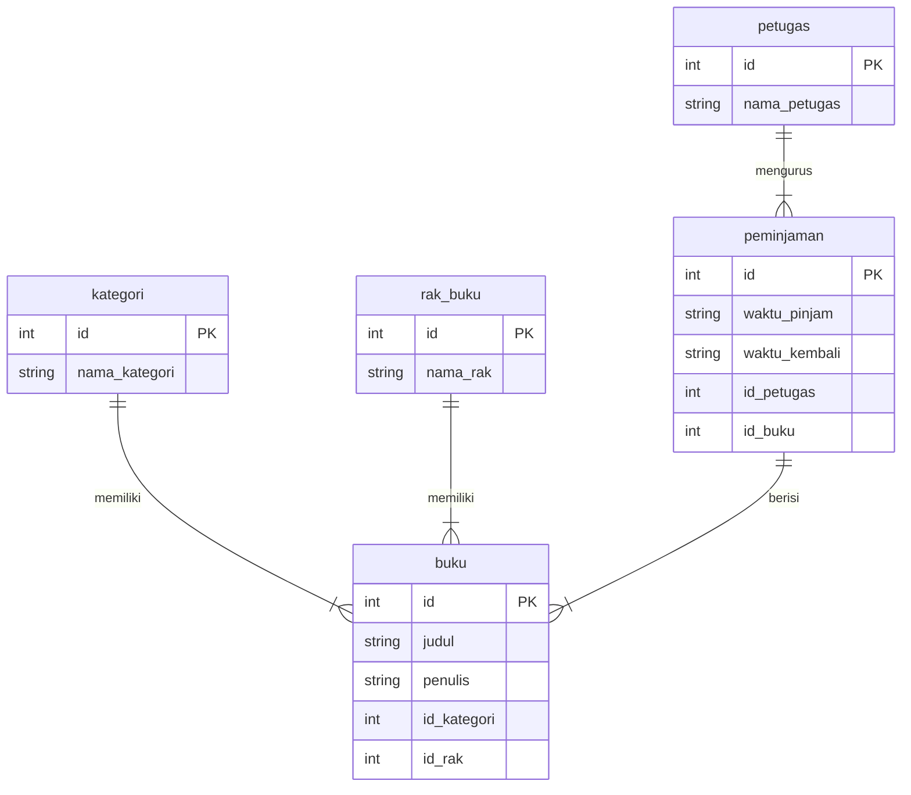
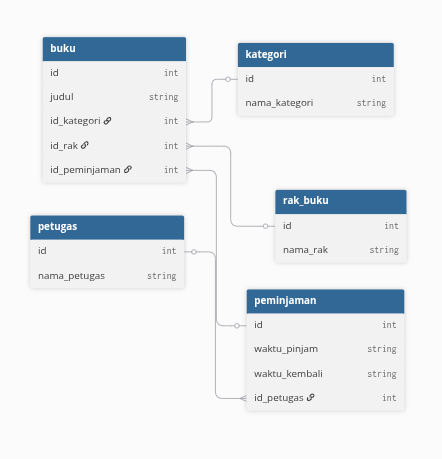
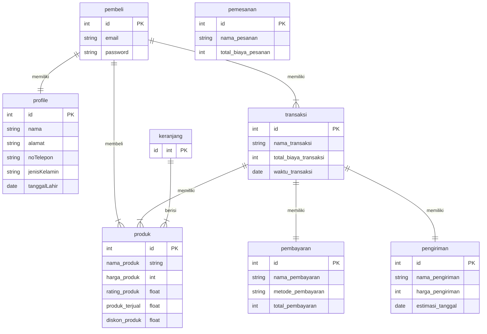

# Minitask 1

```mermaid
erDiagram
    buku {
        int id PK
        string judul
        string penulis
        int id_kategori
        int id_rak 
    }

    kategori {
        int id PK
        string nama_kategori 
    }

    rak_buku {
        int id PK
        string nama_rak 
    }

    petugas {
        int id PK
        string nama_petugas 
    }

    peminjaman {
        int id PK
        string waktu_pinjam 
        string waktu_kembali 
        int id_petugas 
        int id_buku
    }

    kategori ||--|{ buku : "memiliki"
    rak_buku ||--|{ buku : "memiliki"
    petugas ||--|{ peminjaman : "mengurus"
    peminjaman ||--|{ buku : "berisi"
```

# Minitask 2

```mermaid
erDiagram
    pembeli {
        int id PK
        string email 
        string password 
    }

    profile {
        int id PK
        string nama
        string alamat 
        string noTelepon 
        string jenisKelamin
        date tanggalLahir
    }

    pemesanan {
        int id PK
        string nama_pesanan 
        int total_biaya_pesanan
    }

    transaksi {
        int id PK
        string nama_transaksi 
        int total_biaya_transaksi
        date waktu_transaksi 
    }

    pembayaran {
        int id PK
        string nama_pembayaran 
        string metode_pembayaran
        int total_pembayaran
    }

    produk {
        int id PK
        nama_produk string
        harga_produk int
        rating_produk float
        produk_terjual float
        diskon_produk float
    }

    pengiriman {
        int id PK
        string nama_pengiriman
        int harga_pengiriman
        date estimasi_tanggal
    }

    keranjang {
        id int PK
    }

    pembeli ||--|{ produk : "membeli"
    pembeli ||--|| profile : "memiliki"
    pembeli ||--|{ transaksi : "memiliki"
    transaksi ||--|| pembayaran : "memiliki"
    transaksi ||--|{ produk : "memiliki"
    keranjang ||--|{ produk : "berisi"
    transaksi ||--|| pengiriman : "memiliki"

```

